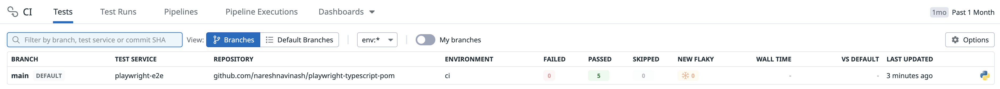
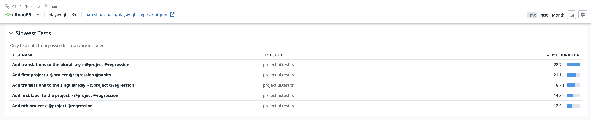
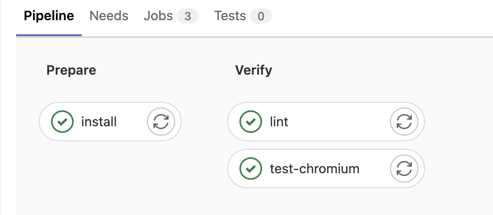

# Playwright in Page Object Model implemented with TypeScript

This project is to create a Page Object Model (POM) framework for UI automation using Playwright in Typescript. To follow the coding standards, ESLinter is addapted and Continuous Integration is achieved through Gitlab CI.


[](LICENSE)
[](https://www.typescriptlang.org/)
[]( https://stackoverflow.com/users/10505289/naresh-sekar )
[](mailto:nareshnavinash@gmail.com)

## Supports
* Multi browser automation
* Modes of run via CLI
* Datadog Integration
* GitLab CI integration
* Failed test vidoes & trace
* Tagging the tests
* Retries of failed tests
* Parallel Run
* ESLinter adapted
* TypeScript compatible

## Setup
* Clone this repository
* Navigate to the cloned folder
* Install node using `brew install node` / compatible one in your OS
* Install yarn using `brew install yarn` / compatible one in your OS
* Install the dependencies with respect to this project by `yarn`

## To Run the tests

To run all the tests in all the browser combinations (chromium, firefox, webkit), one can try
```bash
yarn test
```
This will run all the tests that matches `/tests/*.ts`

### Parallel run
If you have multiple specs to run at a time, one can specify the number of threads that can be open in a single run through,
```bash
yarn test --workers 4
```
Default parallel execution is set to 2 considering general CI instance size and its network capacity & CPU capacity. One can increase or decrease via the above command line argument.

### Headed run
By default, all the tests are headed, if you wish to run them in headed mode do,
```bash
yarn test --headed
```

### Multi-Browser run
To run the tests in a specific browser,
```bash
yarn test --project chromium|firefox|webkit
```
if no browser option is specified, the tests will run in all the browsers. One can use the scripts added in package.json file as well. 
```bash
yarn test:chromium
yarn test:firefox
yarn test:webkit
```

### Running specific tests
In order to run specific tests with specific keyword,
```bash
yarn test -g "Add first project"
```

### Tagged run
We need to add annotations or tags to all the test description. By following this best practice one could achieve running a specific functionality tests alone which spans across multiple files. 
```js
  test('Add first project > @projects @regression @sanity', async ({
    page
  }) => {
    // test scripts
  })

  test('Add first label to the project > @signup @regression', async ({
    page
  }) => {
    // test scripts
  })

```
In the above example signup funtionality tests should have the tag `@projects` within their description which will help us to run all of them even if the tests are in multiple files,
```bash
yarn test --grep @projects
```
Both the `-g` and `--grep` tend to solve the same problem. But using tags proves to be more efficient in terms of performance.

## Reports
I have enabled `junit`, `line` and `html` reporting for this project.
* `JUnit` - Used to upload the execution results to `DataDog`.
* `Line` - To get precise output in CLI.
* `HTML` - If we want to manually check in local.
Apart from these, the suite will take `trace` as well as `video` on their first retry. So whenever the tests failed one can either validate the video from CI Artifacts or if the video seems to be ineffective way of debugging download the trace file and then validate the tests with,
```bash
yarn show-trace <trace-file-path>
```
While running in local, all the report files will be stored under `test-results` folder.

## Why DataDog?
* Analysing reports for each and every run is fine, but we need a collective data from all the executions to visualize and plan for improvements.
* `Allure` report was good with their trends and metrics, but DataDog's CI test results beat all others. 
* In Datadog we could get the collective data about the environment in which it ran, failed, passed, flaky, skipped, wall time (Overall build time - Test execution time) for each and every service.



* More often we are firefighting with the flaky tests, but if we have a centralized data in datadog about all the flaky one, it would be much easier for planning the work and mitigating the same.
* We can easily get to know the top slowest tests and then plan on how to make them faster.



## Retries
* By default retry is set to 1 when the tests run in CI and retry is set to 0 when the tests run in the local.
* As a best practice we need to come away from retries as much as possible to achieve faster feedback loop.

## Linters
ESLint has been integrated with this project structure. This helps in maintaining common code structure when multiple people involved in working with the same base code. This is integrated with CI pipeline as well.

## Best Practices

### Adding page methods to the project

1. Add page specific methods inside the `pageObjects` folder. Name the page files with `<page_name>.page.ts` so that we wont get confused with the file's purpose.

### Adding locator methods to the project 

1. Add locators inside the page file. For static locator one can set the locator value directly in the constructor. Make sure you set the access level for the locator, here we are setting `readonly` access to all the locators.

```js
  readonly addProjectsButton: Locator;

  constructor (page: Page) {
    this.page = page
    this.addProjectsButton = page.locator('button[data-action="add-project"]');
  }
```

2. For dynamic locator, we need to declare them as a method and call them within the page functions as,

```js
  // Declare
  keyListWithName (keyName: string = 'First Key') {
    return this.page.locator(`[id="endless-table"] a[data-value="${keyName}"]`);
  }

  // Use
  await this.keyListWithName('First Key').click()
```

### Creating a new test file in the project

Test files are generally crafted according to our needs, but few of the common practices are,

* Have a global `test.describe` in your test files which describes whether your tests within that file should run in serial or parallel mode.
* Have a sub `test` to describe your current test case.
* Ensure to add necessary tags, this will help us in maintaining / executing the tests in isolation.
```js
test.describe.configure({ mode: 'serial' });

test('Add first project > @project @regression @sanity', async ({ page }) => {
  // test lines
})
```
* Have all the assetions with custom message, since `expected: true, actual: false` default messages are not much helpful to the cross-functional teams.
```js
  expect(
    await projectsPage.getStartedIsDisplayed(),
    'Projects page is not dispalyed'
  ).toBe(true);
```
## Gitlab CI Integration
* For some reason github runners are struck at pending status for a very long time, so added a gitlab CI intergration.
* Sample github CI integration code can be seen in the folder `.github/workflows`
* I have created a sample pipeline in GitLab to execute the linters as well as execute the tests, whenever the code is pushed to cloud.
* A sample pipeline can be seen [here](https://gitlab.com/nareshnavinash/playwright-typescript-pom/-/pipelines/476524440)

* Since playwright downloads browsers everytime when we do `yarn`, I have cached the PlayWright's browser installation path (`~/.cache/ms-playwright`) as well. This will help us speed up the installation step.
* Whenever the test is failed, I am uploading the entire `test-results` folder in artifact, where one could get the video and trace files.
* Check the other pipelines in `CI/CD > pipelines` page in the repo.

### Choosing what to test at E2E level
* We should not automate all the functionalities at the E2E level, since it takes more time to test than that of lower levels.
* We need to find a balance and migrate all the tests that can be migrated to lower levels.
* In this project, UI error message and UI validations can be effectively migrated to integration tests.
* Once we verify that these tests are covered at integration level, we can effectively remove these tests from E2E level.

### Monitoring the tests
* Once the tests are in action, a continuous monitoring of its status via DataDog and lookout for a ways to improve them.
* Generally, as the time goes, the test execution time raises for the existing tests due to the addition of new functionalities.
* To avoid that we need to monitor at least each sprint and ensure everything is in-tact.
* As a hard stop I have set the `timeout` to 5 minutes, so if any of the tests run more than 5 mins, it will fail in the CI.

### [Sample pipeline](https://gitlab.com/nareshnavinash/playwright-typescript-pom/-/pipelines/476524440)

## Built With

* [Playwright](https://playwright.dev/)

## Author

* **[Naresh Sekar](https://www.linkedin.com/in/nareshnavinash/)**

## License

This project is licensed under the MIT License - see the [LICENSE](LICENSE) file for details

## Acknowledgments

* To all the open source contributors whose code has been referred in this project.
